# mITyFighter

A production-grade 2D pixel fighting game built with TypeScript, Phaser 3, and Vite.

## 🎮 Features

- **17 Playable Fighters**: Bartholomew Blaze, Sir Sparksalot, Serpentina, Cassandra Coil, Meg Grimspire, Sir Budgetalot, Count Cardboardius III, Dave the Athletic, Captain Beaky, Lady Emberwhisk, Lady Pointy-Stabby, Brother Silent, The Furious Farmer, Sir Chopington, Arrow Lad, General Dramatic Pause, Elder Honkstorm
- **Story Mode**: Engaging single-player campaign with character-driven narratives
- **2-Player Local**: Shared keyboard with anti-ghosting key zones
- **Pixel-Perfect Rendering**: Crisp pixel art at any resolution
- **Multiplayer-Ready Architecture**: Deterministic simulation with fixed timestep
- **Extensible Design**: Add new fighters/backgrounds with minimal code changes

## 🚀 Quick Start

```bash
# Install dependencies
npm install

# Start development server
npm run dev

# Open http://localhost:3000
```

## 🎹 Controls

### 1 Player Mode

**Player 1 (Left Side)**

| Action | Key |
|--------|-----|
| Move Left | A |
| Move Right | D |
| Jump | W |
| Crouch | S |
| Attack 1 | F |
| Attack 2 | G |
| Special | H |
| Block | R |
| Cycle Character ← | Q |
| Cycle Character → | E |

### 2 Player Mode

**Player 1 (Left Side)**

| Action | Key |
|--------|-----|
| Move Left | A |
| Move Right | D |
| Jump | W |
| Crouch | S |
| Attack 1 | F |
| Attack 2 | G |
| Special | H |
| Block | R |
| Cycle Character ← | Q |
| Cycle Character → | E |

**Player 2 (Right Side - Numpad)**

| Action | Key |
|--------|-----|
| Move Left | ← |
| Move Right | → |
| Jump | ↑ |
| Crouch | ↓ |
| Attack 1 | Numpad 1 |
| Attack 2 | Numpad 2 |
| Special | Numpad 3 |
| Block | Numpad 0 |
| Cycle Character ← | U |
| Cycle Character → | O |

> **No Numpad?** Set `useNumpad: false` in `src/game/config/gameConfig.ts` to use J/K/L/I/U/O/P/Y instead.

### Global

| Action | Key |
|--------|-----|
| Toggle Debug | F1 |
| Cycle Background | Z / C |

## � Story Mode

Experience each fighter's unique narrative in Story Mode! Follow their journey through:

- **Character-Specific Campaigns**: Each fighter has their own storyline with unique dialogue and opponents
- **Progressive Difficulty**: Face increasingly challenging opponents as you advance
- **Story Unlocks**: Unlock additional content and fighter interactions as you progress
- **Arcade Mode**: Quick, single-session combat without the narrative elements

Select your fighter and begin their story in the Mode Select menu!
## 🎭 Meet the Fighters

### Bartholomew Blaze
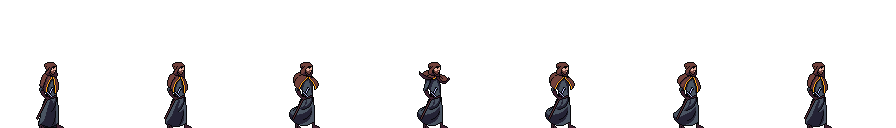
> *"It's not arson if I announce it loudly beforehand."*

A wizard of flame, smoke, and deeply irresponsible enthusiasm. Bartholomew once tried to toast bread using a meteor spell and accidentally invented a new desert. Banned from libraries, haystacks, and most weddings.

### Sir Sparksalot
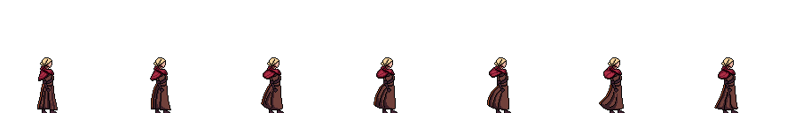
> *"I don't do small talk. I do large lightning."*

Struck by lightning as a child, Sir Sparksalot responded by suing the weather. He channels thunder professionally with dramatic hair and zero patience. He cannot enter a room quietly. Ever.

### Lady Serpentina
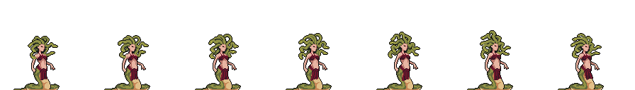
> *"Smile politely. I can still petrify you."*

An aristocrat with impeccable posture and a hair situation that legally counts as wildlife. She speaks five languages, none of them friendly. Her hobbies include etiquette, fencing, and turning rude people into tasteful garden décor.

### Cassandra Coil
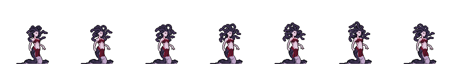
> *"I'm not toxic — I'm motivationally venomous."*

Fast, chaotic, and emotionally supported by her extremely aggressive snake-hair. She once started a duel because someone sighed "too loudly in her direction." She treats combat like a dance — if the dance involved kicking someone into a wall.

### Meg Grimspire
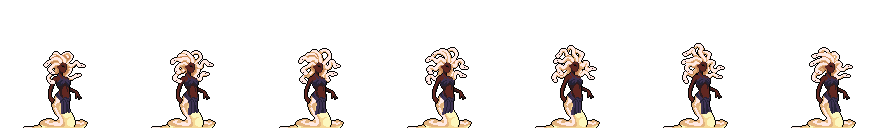
> *"The shadows are lovely company."*

A naturally cheerful person who collects cursed artifacts and names them after loved ones. She decorates with bones, speaks to ghosts, and is somehow everyone's favorite at parties. Her optimism in the face of cosmic horror is truly inspiring.

### Sir Budgetalot
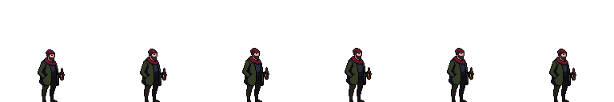
> *"A knight is measured by his financial responsibility and devastating uppercuts."*

A modern knight obsessed with compound interest and proper armor maintenance. He fights with the precision of a ledger and the confidence of a man who has already budgeted for collateral damage.

### Count Cardboardius III
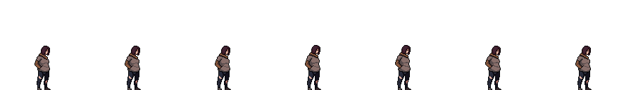
> *"I am literally cardboard. Yes, literally. Don't test this."*

A sentient piece of cardboard who refuses to acknowledge this fact and insists he's royalty. He's somehow more durable than everyone expects and gets increasingly crumpled as fights go on. Surprisingly sophisticated for recycled material.

### Dave the Athletic
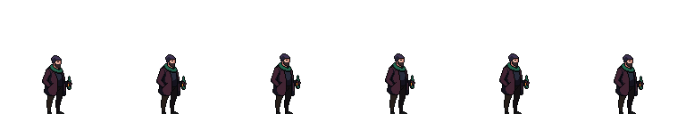
> *"Actually, this IS a gym. Everything is a gym if you're committed enough."*

A man of unreasonable athleticism who treats combat like training montage material. He'll do a backflip for no reason, strike unnecessary poses, and somehow always land perfectly. He's exhausting to fight because he doesn't seem to understand the concept of "tired."

### Captain Beaky
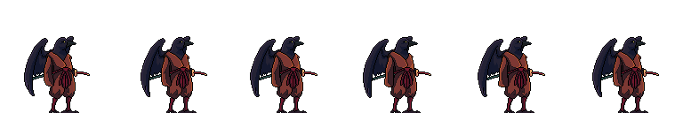
> *"Squawk means business."*

A pirate bird of unspecified species with a hook for one wing and an alcohol problem. He's sailed every sea, survived every disaster, and is currently very confused about where the actual ocean went. Still fights like he has a ship full of rum at stake.

### Lady Emberwhisk
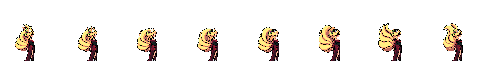
> *"I came here to seduce and devastate. I'm out of seduce."*

A warrior who fights with fire and flair. She's equal parts charm and chaos, leaving a trail of singed confidence and witty one-liners everywhere she goes. Her dramatic entrances have caused structural damage.

### Lady Pointy-Stabby
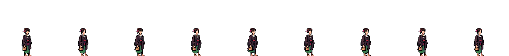
> *"I have a very specific set of poke holes. And I will find them."*

An obsessive perfectionistWith an encyclopedic knowledge of exactly where to poke things. She speaks only when it's useful and fights with surgical precision. Her opponents never see the next strike coming because she's already three steps ahead.

### Brother Silent
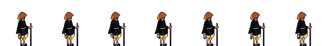
> *[Silent contemplation]*

A monk of the vow of silence who has taken this very seriously. Communicates through interpretive combat. His opponents often can't tell if they're being fought or enlightened. Surprisingly, his screams of pain break the silence sometimes.

### The Furious Farmer
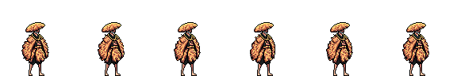
> *"You best apologize to my turnips right now."*

A farmer pushed to his absolute limits by crop-destroying tournament spectators. Armed with farm implements and an encyclopedic knowledge of soil composition. His rage is solar-powered and renewable.

### Sir Chopington
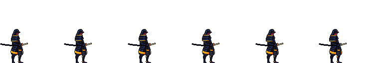
> *"Chop. Chop. CHOP!"*

A lumberjack knight who solves problems by chopping them. Leaves, trees, tournament equipment, existential dread — if it's there, he will chop it. His battle cry has been known to fell nearby forests.

### Arrow Lad
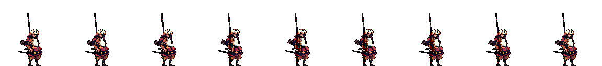
> *"I am incredibly overdressed for this."*

A rogue archer who showed up to a melee tournament because he misread the invitation. Shoots arrows at impossible angles while complaining about the dress code. Somehow still winning.

### General Dramatic Pause
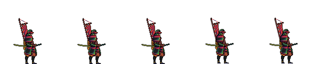
> *[Takes a very long pause before speaking]*

A military commander who makes every decision a drawn-out theatrical event. He will announce his attack five seconds before executing it, giving everyone time to appreciate his confidence. Weirdly, this doesn't make him less effective.

### Elder Honkstorm
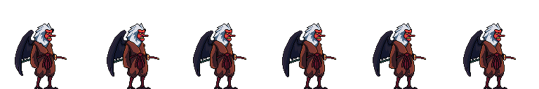
> *"What do you mean 'past my prime'? I'm just getting started."*

An ancient honking force of nature who refuses to retire. Surprisingly spry for his age and has a lot of ancient wisdom to share via combat. His experience makes up for what he lacks in patience.
## �📁 Project Structure

```
mITyFighter/
├── docs/                    # Spec-Kit documentation
│   ├── SPEC_KIT.md         # Development contract
│   ├── ASSETS.md           # Asset conventions
│   ├── ANIMATIONS.md       # Animation system
│   ├── INPUT.md            # Input system
│   ├── NETPLAY_ROADMAP.md  # Future multiplayer
│   ├── EXTENSIBILITY.md    # Adding content
│   ├── ARCHITECTURE.md     # Code structure
│   └── QUALITY_GATES.md    # Quality standards
├── src/
│   ├── main.ts             # Entry point
│   └── game/
│       ├── GameApp.ts      # Application orchestrator
│       ├── config/         # Configuration
│       ├── sim/            # Deterministic simulation
│       ├── assets/         # Asset registries
│       ├── scenes/         # Phaser scenes
│       ├── render/         # Rendering components
│       ├── input/          # Input handling
│       └── utils/          # Utilities
├── sprites/                # Fighter sprite sheets
├── tools/                  # Build tools
└── tests/                  # Unit tests
```

## 🌐 Play Online

The game is hosted on GitHub Pages: **[Play mITyFighter](https://YOUR_USERNAME.github.io/mITyFighter/)**

> Replace `YOUR_USERNAME` with the actual GitHub username/organization once deployed.

## 📚 Documentation

**Read the Spec-Kit before contributing:**

- [SPEC_KIT.md](docs/SPEC_KIT.md) - Development contract (START HERE)
- [EXTENSIBILITY.md](docs/EXTENSIBILITY.md) - How to add fighters/backgrounds
- [ARCHITECTURE.md](docs/ARCHITECTURE.md) - Code structure
- [QUALITY_GATES.md](docs/QUALITY_GATES.md) - Quality standards

## 🛠️ Development

### Scripts

```bash
npm run dev           # Start dev server
npm run build         # Production build
npm run lint          # Check code style
npm run lint:fix      # Fix code style
npm run test          # Run tests
npm run validate:assets  # Validate sprites
npm run validate:all  # All checks
```

### Adding a New Fighter

1. Add sprite sheets to `sprites/<FighterName>/`
2. Update `src/game/assets/fighterRegistry.ts`
3. Update `docs/ASSETS.md`
4. Run `npm run validate:assets`

See [EXTENSIBILITY.md](docs/EXTENSIBILITY.md) for details.

## 🏗️ Architecture

```
Input → InputManager → InputFrame (bitmask)
                            ↓
                    FixedTimestepLoop (60Hz)
                            ↓
                      Simulation
                            ↓
                       Renderer
```

- **Simulation** (`sim/`): Deterministic game logic, no Phaser dependencies
- **Render** (`render/`): Phaser sprites and visuals
- **Input** (`input/`): Keyboard handling, per-tick capture

This separation enables future rollback netcode.

## 🚀 Deployment

### GitHub Pages (Automatic)

The game automatically deploys to GitHub Pages when you push to the `main` branch.

**Setup:**
1. Go to your repository's **Settings** → **Pages**
2. Under "Build and deployment", select **GitHub Actions** as the source
3. Push to `main` and the game will deploy automatically

**Manual deployment:**
- Go to **Actions** → **Deploy to GitHub Pages** → **Run workflow**

### Local Production Build

```bash
npm run build         # Build to ./dist
npm run preview       # Preview the build locally
```

